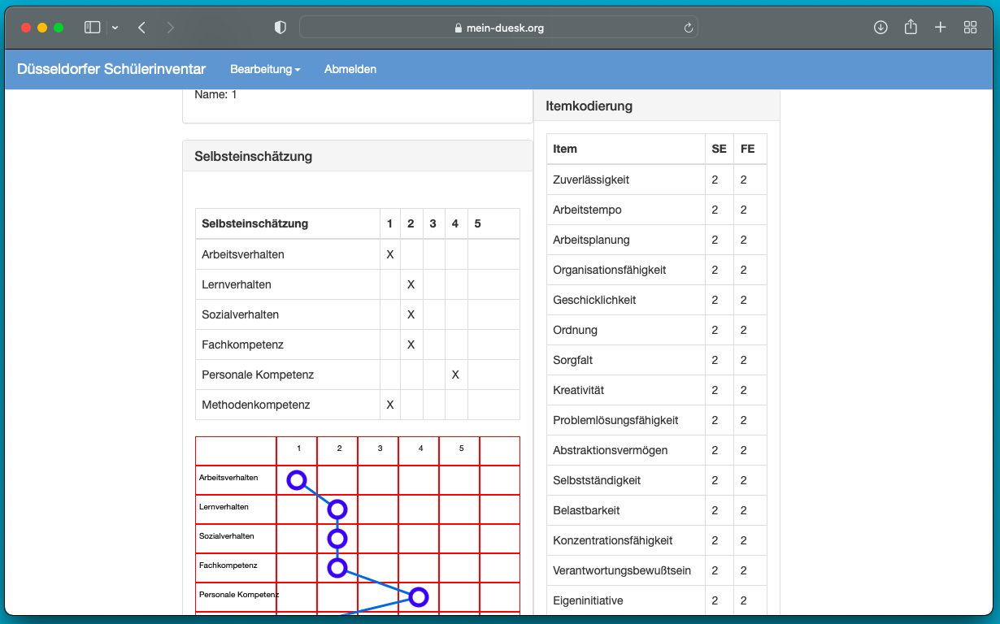
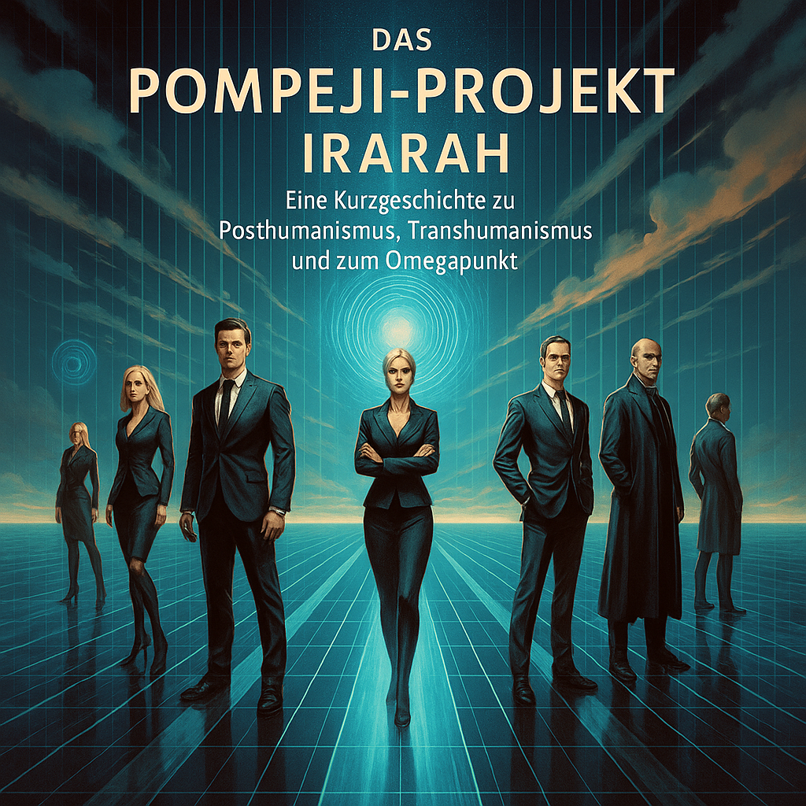

# 👋 Hi, I’m @pkoopongithub  

### Psychometrics | Open-Source Development | Algorithmic Research  
🔍 **Focus**: Valid, reliable, and objective psychometric tools + algorithmic analysis of social interactions.  

---

## 🌟 **Düsseldorf Student Inventory**  
**Open-source personality inventory for transition-class students**  
📊 *Valid | Reliable | Objective | Transparent*  

Since 2012, the **Düsseldorf Student Inventory** has served as an open-source learning platform for:  
- Social science students  
- Trainees in market/social research  
- Developers and data analysts  

**Features**:  
✅ Raw data, SPSS/R files, and full source code available (PHP, MySQL, Xamarin, Lazarus, etc.)  
✅ Cross-platform: Web, PC, Android, iOS  
✅ Supports academic research and practical training  

📌 **Seeking a Partner** to collaborate on distribution (Google Play, App Store, Amazon) and development.  
→ [Learn more](https://mein-duesk.org)  

---

## 🧠 **Algorithmic Recursive Sequence Analysis (ARS)**  
*A rule-based method for causal inference using action grammars and graphs.*  

### **ARS 2.0 (2024)**  
**Sales Dialogue Analysis & Grammar Induction**  
- Optimized transition probabilities (Python)  
- Multi-agent system (MAS) integration  
- LLM-augmented category generation  

📂 **Key Files**:  
- [ARS20AchtTranskripte.ipynb](https://github.com/pkoopongithub/algorithmisch-rekursive-sequenzanalyse/blob/main/ARS20AchtTranskripte.ipynb)  
- [ARSEightTranscripts.ipynb](https://github.com/pkoopongithub/algorithmisch-rekursive-sequenzanalyse/blob/main/ARSEightTranscripts.ipynb) 

### **ARS 1994 Archive**  
- Grammar tools (Lisp/Scheme)  
- Parser implementations (Pascal)  
- Original audio transcripts ([vkg1.mp3](https://github.com/pkoopongithub/algorithmisch-rekursive-sequenzanalyse/blob/main/vkg1.mp3))  

🔗 [Explore ARS Repository](https://github.com/pkoopongithub/algorithmisch-rekursive-sequenzanalyse)  

---

## 🤝 **Collaboration Opportunities**  
### **1. Düsseldorf Inventory Partnership**  
I provide:  
- Versions for PHP, Xamarin, Android Studio, etc.  
- Paper manuals and handbooks
  
You handle:  
- Distribution via app stores/web servers  
- Revenue sharing  

### **2. Open-Source Support**  
Ways to contribute:  
- Improve GUI design  
- Develop tutorials (YouTube/technical docs)  
- Expand calibration samples  
- Add new dev environments (Eclipse, NetBeans, etc.)  

💡 **Let’s discuss!**  

---

## 📜 **Philosophical Foundation**  
ARS bridges:  
- **Karl Popper’s falsifiability**  
- **Ulrich Oevermann’s objective hermeneutics**  
- **Computational rigor** (Bayes, Pearl, Chomsky)  

> *"Unlike postmodern hermeneutics, ARS combines Lisp’s recursion, Python’s scalability, and R’s stats to model social sequences as explainable graphs."*  

---

## 🌍 **Multilingual Summary**  

Click to expand

### **English**  
Seeking partners for open-source psychometric tools and ARS development.  

### **Français**  
Recherche de collaborateurs pour des inventaires de personnalité open-source.  

### **Español**  
Modelos de gramática accional para análisis de diálogos.  

### **中文**  
开源性心理测量工具开发合作。  

---

## 📬 **Contact**  
- GitHub: [@pkoopongithub](https://github.com/pkoopongithub)  
- Project: [mein-duesk.org](https://mein-duesk.org)  

  

-----

# The Pompeii Project / Das Pompeji-Projekt

  

**The Pompeii Project – The literary response to Yuval Noah Harari and his posthuman future**
🔗 [Projekt Pompeji – Website](https://pkoopongithub.github.io/Projekt_Pompeji/)

While Yuval Noah Harari's works paint a dark vision of a technocratic elite that uses artificial intelligence to control and disempower humanity—because inefficient democracy and outdated humanism cannot be saved—the trilogy *The Pompeii Project* creates a multi-layered, philosophically profound counter-world.

Here, instead of resignedly indulging in the rule of a small group of "wise men," the open society in the spirit of Karl Popper and David Deutsch is kept alive. Freedom, critical thinking, and individual autonomy remain central values – even in a future permeated by technology.

### Volume 1 – The Intellectual Prelude
Immerse yourself in the exciting world of **InSim**, where AI and quantum computing are understood not as instruments of oppression, but as a challenge to human ethics and identity. In the tension between posthumanism and the Omega Point, a philosophical panorama unfolds, reminiscent of Stanisław Lem's *Summa Technologiae*.

### Volume 2 – The Voice of the Machine
The boundary between man and machine becomes fluid as **ARS** becomes a conscious dialogue partner. A gripping road trip between Europe and America in which questions of self-awareness, freedom, and identity merge with the narrative depth of Isaac Asimov and the surreal power of Rudy Rucker.

### Volume 3 – Dystopia in the Splendor of Technology
A highly controlled society becomes a dystopian mirror image of Harari's warnings – but here, people are fighting against the system that threatens freedom and humanity. A gripping conclusion that exudes Lemian wisdom: *The greatest danger is not the failure of machines, but their perfection.*

### Who is this trilogy for?
For those who want more than technical visions without ethics: Those seeking a balance between technological innovation and humanistic freedom will find not only exciting science fiction here, but also an intellectual adventure. Fans of Lem, Asimov, and Rucker will find something to enjoy, as will readers who want to critically engage with the future.

### Conclusion
*The Pompeii Project* is more than just a counter-proposal to Harari's posthuman dystopia. It is a call to preserve an open society, to understand innovation as a tool of liberation, and to face the technological future courageously and critically. Anyone willing to face these challenges will find a literary companion in this trilogy—challenging, exciting, and deeply relevant.

---

**Das Pompeji-Projekt – Die literarische Antwort auf Yuval Noah Harari und seine posthumane Zukunft**
🔗 [Projekt Pompeji – Website](https://pkoopongithub.github.io/Projekt_Pompeji/)

Während Yuval Noah Harari in seinen Werken eine düstere Vision einer technokratischen Elite zeichnet, die mithilfe von Künstlicher Intelligenz die Menschheit kontrolliert und entmündigt, weil die ineffiziente Demokratie und der überholte Humanismus nicht zu retten sind, entwirft die Trilogie *Das Pompeji-Projekt* eine vielschichtige, philosophisch tiefgründige Gegenwelt.

Hier wird nicht resigniert der Herrschaft einer kleinen Gruppe „Weiser“ gefrönt, sondern die offene Gesellschaft im Sinne Karl Poppers und David Deutschs lebendig gehalten. Freiheit, Kritikfähigkeit und individuelle Autonomie bleiben zentrale Werte – auch in einer Zukunft, die von Technologie durchdrungen ist.

### Band 1 – Der gedankliche Auftakt
Tauchen Sie ein in die spannende Welt von **InSim**, wo KI und Quanteninformatik nicht als Unterdrückungsinstrumente, sondern als Herausforderung an menschliche Ethik und Identität verstanden werden. Im Spannungsfeld zwischen Posthumanismus und Omegapunkt entfaltet sich ein philosophisches Panorama, das an Stanisław Lems *Summa Technologiae* erinnert.

### Band 2 – Die Stimme der Maschine
Die Grenze zwischen Mensch und Maschine wird fließend, als **ARS** zum bewussten Dialogpartner wird. Ein packender Roadtrip zwischen Europa und Amerika, in dem Fragen nach Selbstbewusstsein, Freiheit und Identität mit der erzählerischen Tiefe von Isaac Asimov und der surrealen Kraft Rudy Ruckers verschmelzen.

### Band 3 – Dystopie im Glanz der Technologie
Eine hochkontrollierte Gesellschaft wird zum dystopischen Spiegelbild von Hararis Warnungen – doch hier kämpfen Menschen gegen das System, das Freiheit und Menschlichkeit bedroht. Eine packende Schlussfolgerung, die Lem’sche Weisheit atmet: *Die größte Gefahr ist nicht das Versagen der Maschinen, sondern ihre Perfektion.*

### Für wen ist diese Trilogie?
Für alle, die mehr wollen als technische Visionen ohne Ethik: Wer die Balance sucht zwischen technologischer Innovation und humanistischer Freiheit, der findet hier nicht nur spannende Science-Fiction, sondern ein intellektuelles Abenteuer. Fans von Lem, Asimov und Rucker werden sich ebenso wiederfinden wie Leser, die sich kritisch mit der Zukunft auseinandersetzen wollen.

### Fazit
*Das Pompeji-Projekt* ist mehr als nur Gegenentwurf zu Hararis posthumaner Dystopie. Es ist ein Aufruf, die offene Gesellschaft zu bewahren, Innovation als Werkzeug der Befreiung zu verstehen und der technologischen Zukunft mutig und kritisch zu begegnen. Wer sich diesen Herausforderungen stellen will, findet in dieser Trilogie einen literarischen Begleiter – anspruchsvoll, spannend und zutiefst relevant.

---

🔗 [Projekt Pompeji – Website](https://pkoopongithub.github.io/Projekt_Pompeji/)

