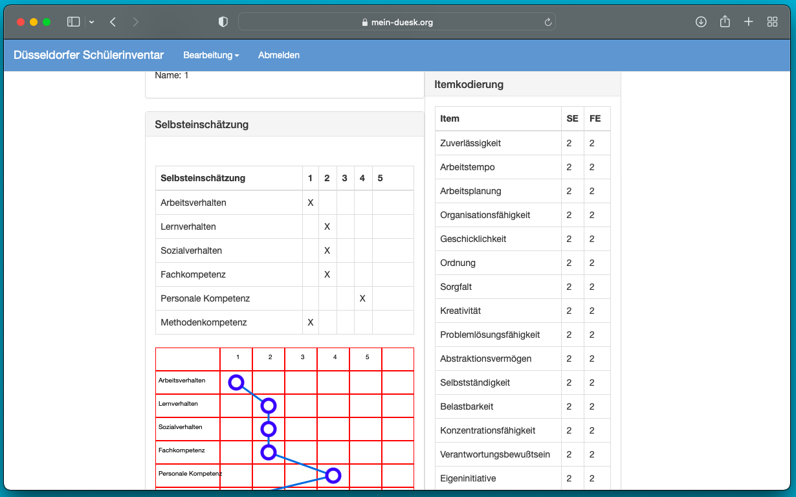

# 👋 @pkoopongithub  

### 🧩 Psychometrics · Open-Source Development · Algorithmic Research  
🔍 **Focus:** Valid, reliable, and transparent psychometric tools · Algorithmic analysis of social interaction sequences  

---

---

## 🌟 Düsseldorf Student Inventory (DÜSK)  

**An open-source personality inventory for transition-class students**  
📊 *Valid · Reliable · Objective · Transparent*

Since 2012, the **Düsseldorf Student Inventory (DÜSK)** has served as an open learning and research platform for:  
- Students in the social sciences  
- Trainees in market and social research  
- Developers and data analysts  

**Features**  
- ✅ Full source code (PHP, MySQL, Xamarin, Lazarus, etc.)  
- ✅ Open raw data + SPSS/R data files  
- ✅ Cross-platform: Web · PC · Android · iOS  
- ✅ For research, teaching, and applied practice  

📌 **Collaboration invited**  
Joint development and distribution via app stores (Google Play, App Store, Amazon).  

---

# ARS_ExplainableAI  
**Algorithmic Recursive Sequence Analysis for Explainable AI in Qualitative Social Research**

## 📋 Overview (English)

**ARS_ExplainableAI** is a methodological and software-based framework for **Algorithmic Recursive Sequence Analysis (ARS)**.  
It integrates qualitative hermeneutics with formal modeling and contributes to **Explainable Artificial Intelligence (XAI)** in text analysis.

This repository contains:

- Complete scientific papers on ARS methodology (German / English)  
- Python implementations for grammar induction from terminal symbol sequences  
- Advanced network modeling via transformation into Petri nets and Bayesian networks  
- Compressing principles (repetition, recursion, symmetry, hierarchy)  
- Optimization algorithms for iterative adjustment of transition probabilities  
- Eight transcripts of sales conversations as an empirical basis  

---

## 🎯 Objectives (English)

Qualitative social research faces a methodological dilemma:  
Generative AI systems promise scalability but evade classical validation due to their opacity.

**ARS_ExplainableAI** addresses this challenge through:

- **Transparent model construction** – every interpretative step is explicitly documented  
- **Formalization of qualitative processes** – transformation of interpretations into terminal symbol sequences  
- **Explainable network models** – compressive transformation into Petri and Bayesian networks  
- **Recursive self-application** – AI as an epistemic agent reflecting on its own interpretations  

---

## 📋 Überblick (Deutsch)

**ARS_ExplainableAI** ist ein methodologisches und softwaretechnisches Framework zur  
**Algorithmisch Rekursiven Sequenzanalyse (ARS)**.  
Es verbindet qualitative Hermeneutik mit formaler Modellierung und leistet einen Beitrag zur  
**erklärbaren Künstlichen Intelligenz (XAI)** in der Textanalyse.

Dieses Repository enthält:

- Vollständige wissenschaftliche Aufsätze zur ARS-Methodologie (Deutsch / Englisch)  
- Python-Implementierungen zur Grammatikinduktion aus Terminalzeichenketten  
- Erweiterte Netzmodellierung durch Transformation in Petri-Netze und Bayessche Netze  
- Komprimierende Prinzipien (Wiederholung, Rekursion, Symmetrie, Hierarchie)  
- Optimierungsalgorithmen zur iterativen Anpassung von Übergangswahrscheinlichkeiten  
- Acht Transkripte von Verkaufsgesprächen als empirische Basis  

---

## 🎯 Zielsetzung (Deutsch)

Die qualitative Sozialforschung steht vor einem methodologischen Dilemma:  
Generative KI-Systeme versprechen Skalierung, entziehen sich jedoch aufgrund ihrer Opazität der klassischen Validierung.

**ARS_ExplainableAI** begegnet diesem Problem durch:

- **Transparente Modellbildung** – jeder Interpretationsschritt wird explizit dokumentiert  
- **Formalisierung qualitativer Prozesse** – Überführung von Lesarten in Terminalzeichenketten  
- **Erklärbare Netzmodelle** – komprimierende Transformation in Petri- und Bayessche Netze  

---

## 🧠 Algorithmic Recursive Sequence Analysis (ARS)  

*A rule-based method for causal inference using action grammars and graphs.*

### ARS 2.0 (2024)  
**Sales Dialogue Analysis & Grammar Induction**  
- Optimized transition probabilities (Python)  
- Multi-Agent-System (MAS) integration  
- LLM-assisted category generation  

**Key Notebooks**  
- [ARS20AchtTranskripte.ipynb](https://github.com/pkoopongithub/algorithmisch-rekursive-sequenzanalyse/blob/main/ARS20AchtTranskripte.ipynb)  
- [ARSEightTranscripts.ipynb](https://github.com/pkoopongithub/algorithmisch-rekursive-sequenzanalyse/blob/main/ARSEightTranscripts.ipynb)

### ARS Archive (1994–)  
- Grammar tools (Lisp/Scheme)  
- Parser implementations (Pascal)  
- Original transcripts and audio ([vkg1.mp3](https://github.com/pkoopongithub/algorithmisch-rekursive-sequenzanalyse/blob/main/vkg1.mp3))

🔗 [Explore the ARS Repository](https://github.com/pkoopongithub/algorithmisch-rekursive-sequenzanalyse)

---

## 🤝 Collaboration Opportunities  

### 1️⃣ Düsseldorf Inventory Partnership  
**I provide:**  
- Source versions (PHP, Xamarin, Android Studio, etc.)  
- Manuals and documentation  

**You handle:**  
- Distribution via app stores or web servers  
- Revenue sharing agreement  

### 2️⃣ Open-Source Contributions  
Ways to collaborate:  
- Improve GUI design  
- Write tutorials (YouTube / technical documentation)  
- Expand calibration samples  
- Port software to new environments (Eclipse, NetBeans, etc.)

💬 *Let’s collaborate on transparent, evidence-based psychometrics.*

---

## 📜 Philosophical Foundation  

**ARS bridges**  
- **Karl Popper’s** falsifiability principle  
- **Ulrich Oevermann’s** objective hermeneutics  
- **Computational rigor** (*Bayes · Pearl · Chomsky*)

> “Unlike postmodern hermeneutics, ARS combines Lisp’s recursion, Python’s scalability, and R’s statistics to model social sequences as explainable graphs.”

---

## 🌍 Multilingual Summary  

Click to expand

**English:** Seeking partners for open-source psychometric tools and ARS development.  
**Français:** Recherche de collaborateurs pour des inventaires de personnalité open-source.  
**Español:** Modelos de gramática accional para análisis de diálogos.  
**中文:** 开源性心理测量工具开发合作。  

---

## 🏛️ The Pompeii Project / Das Pompeji-Projekt  

  

### ⚠️ Attention, Boredom! / Achtung, Langeweile!  

This trilogy is *not* for everyone …  
- **no explosions or chase scenes**  
- **no heroes or villains**  
- **no confirmation of your worldview**

---

### 🕊️ The Last Freedom / Die letzte Freiheit  

A philosophical thought experiment disguised as a technical thriller —  
about **posthumanism**, **algorithms**, and the **future of democracy**.  

If you expect entertainment, you will be disappointed.  
If you expect to **think**, you will be challenged.

> “Every page demands your thinking – not just your excitement.”

**The Last Freedom / Die letzte Freiheit**  
*Your brain will not be spared.* / *Ihr Gehirn wird nicht verschont.*

---

## 📬 Contact  

- GitHub: [@pkoopongithub](https://github.com/pkoopongithub)  

